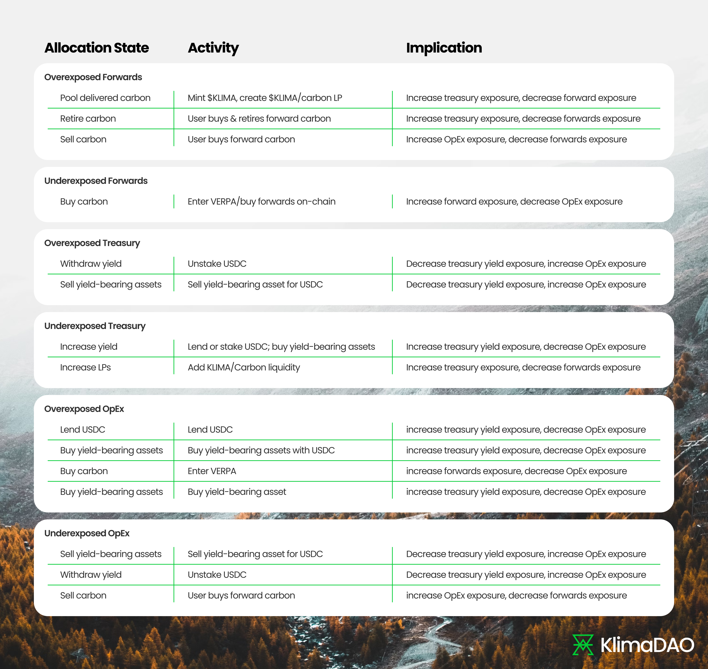

# Green Ratio

#### The Green Ratio

The Green Ratio, as established in [KIP-55](https://forum.klimadao.finance/d/293-kip-55-the-green-ratio), represents an economic framework guiding the allocation of KLIMA's treasury assets, thereby shaping its operational and strategic direction. This ratio is a fundamental principle that positions KLIMA as an index of environmental assets, calibrated to reflect KLIMA’s commitment to environmental sustainability and economic resilience.

#### Analytical Overview of the Green Ratio

At its inception, the Green Ratio delineates the treasury's asset allocation into four primary categories: Forward Carbon, Treasury Reserves, Operational Expenditure (OpEx), and Carbon Backing, with an initial weighting of:

* Forward Carbon {22%\}
* Treasury {48%\}
* Operational Expenditure (OpEx) {10%\}
* Carbon Backing {20%\}

**Forward Carbon (22%)**

Forward Carbon represents commitments to future carbon credits. These are essentially agreements to purchase carbon offsets that will be generated from environmental projects.

KLIMA has pursued multiple deals approved by KlimaDAO proposals, aimed at securing future carbon credits. Some examples include agreements with [reforestation projects](https://forum.klimadao.finance/d/288-kip-51-gro-foundation-arr-project-funding), community based [water filtration initiatives](https://forum.klimadao.finance/d/289-kip-52-iot-ai-ml-on-blockchain-water-filtration-high-quality-project-kip), [biochar](https://forum.klimadao.finance/d/311-kip-58-puro-biochar-sky-east-invest-ltd-klimadao), and [direct air capture](https://forum.klimadao.finance/d/246-kip-41-aither-limenet-mineral-ocean-alkalinity-enhancement) (DAC) with storage via ocean alkalinity enhancement.

#### Treasury (48%)

The Treasury basket includes a variety of assets held by the protocol that are not immediately earmarked for carbon backing. This includes protocol-owned liquidity, spot carbon credits not used for backing, and deployed USDC.

Components:

* Protocol Owned Liquidity (POL): Assets held in liquidity pools that provide market depth and stability for KLIMA and its associated carbon credit tokens.
* Spot Carbon: Carbon credits that are immediately available but not currently designated for backing KLIMA tokens.
* Deployed USD: Financial assets, possibly in stablecoins like USDC, that are invested or deployed in yield-generating activities to support the protocol's financial health.

#### Operational Expenditure (OpEx) (10%)

OpEx covers the day-to-day operational costs of running KlimaDAO, including everything from development work to marketing and legal fees.

Components:

* Idle USDC or USD: Liquid assets reserved for operational expenses, ensuring that the protocol can cover its immediate and short-term needs without compromising its strategic asset allocations.

#### Carbon Backing (22%)

Carbon Backing is the core of KLIMA's value proposition, ensuring that each KLIMA token is backed by tangible environmental assets.\

Components:

* Base Carbon Tonnes (BCT): The primary asset used for backing KLIMA tokens. BCTs are carbon credits verified by recognized standards, providing a direct link between KLIMA's market value and its environmental impact.

\
**Potential Allocation States:**

<figure><figcaption></figcaption></figure>

#### Tactical Allocation for Rebalancing

To account for fluctuations in market conditions that may cause the asset ratio to drift from the foundational 22:48:10:20 allocation, a tactical allocation of up to 10% of the net asset value is permitted. For example, at any given time as little as 0% or as much as 20% of the treasury may be ring-fenced for OpEx. This shift is not for the exploration of alternative investments but serves as a rebalancing buffer.

The tactical allocation allows the DAO to adjust holdings in each of the primary categories in order to realign them with the foundational 22:48:10:20. Such adjustments should be data-driven and predicated on market analytics.

The tactical allocation will be reviewed in each quarterly report, aiming to restore the foundational allocation, unless market analytics provide a strong justification for maintaining the current course or adjusting the ratio.

#### Economic Rationale Behind the Green Ratio

Optimizing Economic Decision-Making: The Green Ratio enables KLIMA to navigate the volatile environmental commodity markets with precision. By allocating assets across different categories, KLIMA can optimize its economic decisions, focusing on long-term growth and sustainability. This strategic diversification reduces risk and enhances the protocol's ability to capitalize on market opportunities.

Promoting Efficiency and Alignment: The framework ensures that KLIMA's resources are deployed in a manner that aligns with its overarching goals of promoting environmental sustainability and market efficiency. It provides a clear roadmap for resource allocation, ensuring that every decision is made with the protocol's long-term vision in mind.

Adapting to Market Conditions: The tactical allocation buffer within the Green Ratio allows KLIMA to adjust its asset distribution in response to market fluctuations. This flexibility is crucial for maintaining the protocol's economic stability and ensuring its resilience against market cycles.

#### KLIMA as an Index of Environmental Assets

The governance of KLIMA's treasury assets through the Green Ratio effectively positions the protocol as an index of environmental assets. This is critical for several reasons:

Market Representation: By aligning its asset allocation with the dynamics of the environmental commodity markets, KLIMA offers stakeholders a representative index of the market's performance and opportunities. This representation enhances KLIMA's utility as a vehicle for environmental investment and engagement.

Value Stability: The strategic management of treasury assets under the Green Ratio contributes to KLIMA's stability as a store of value. By ensuring that asset allocation is responsive to market conditions and protocol objectives, KLIMA maintains its economic viability and attractiveness as a currency.

Environmental Impact: The allocation towards Forward Carbon and Carbon Backing directly ties KLIMA's value to tangible environmental outcomes. This linkage ensures that KLIMA's growth and success are intrinsically connected to its positive impact on the environment, reinforcing its role as a sound vehicle for environmental finance.

#### Conclusion

The Green Ratio is a testament to KLIMA's innovative approach to economic management and environmental sustainability. By governing the allocation of treasury assets with precision and foresight, KLIMA not only optimizes its economic performance but also solidifies its position as a leading index of environmental assets. This strategic framework ensures that KLIMA remains a resilient and impactful currency, capable of navigating the complexities of the environmental commodity markets while driving meaningful change.
