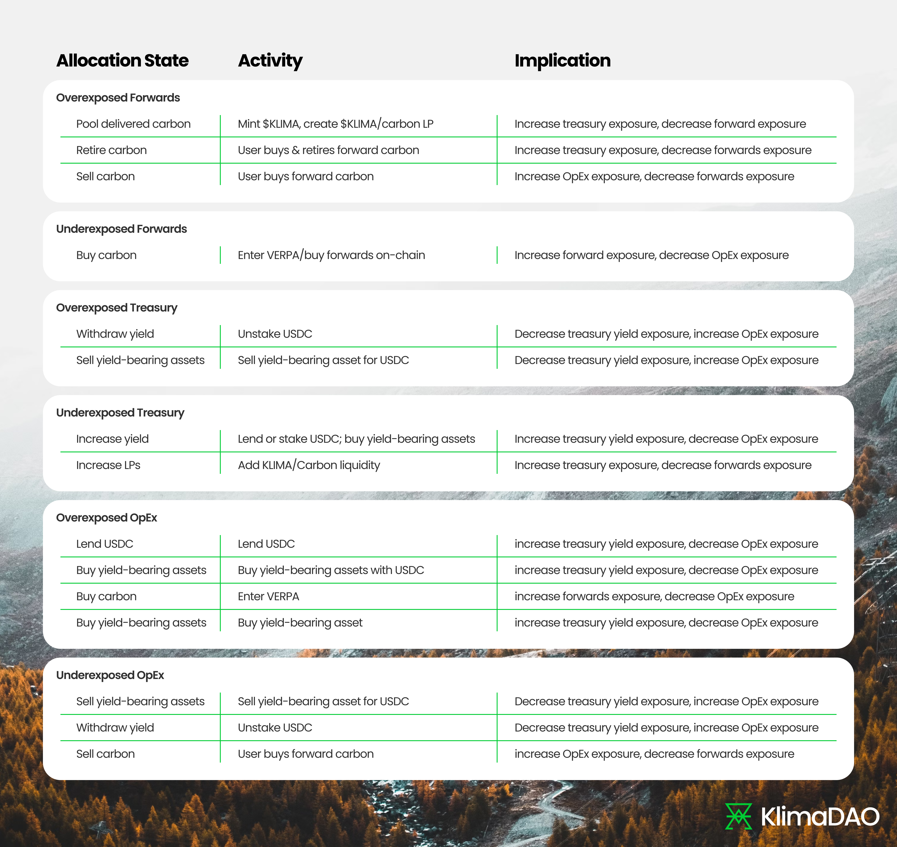

# Green Ratio

Implemented in [KIP-55](https://forum.klimadao.finance/d/293-kip-55-the-green-ratio), The Green Ratio is a strategic framework implemented by KlimaDAO to guide the allocation of its assets, providing clarity to the community and market stakeholders regarding the DAO's resource deployment. By codifying the distribution of funds into specific opportunity areas, the Green Ratio aims to optimize economic decision-making, promote efficiency, and ensure alignment with the DAO's objectives.

## Overview

The Green Ratio framework established a foundational allocation ratio across four primary areas:

* Forward Carbon {22%\}
* Treasury {48%\}
* Operational Expenditure (OpEx) {10%\}
* Carbon Backing {20%\}

The 22:48:10:20 ratio was proposed as the starting ratio, although it may be modified via future KIPs as more data and performance metrics come to light.

The strategic implications of this framework are such that, during periods of high USDC holdings, the Protocol will be more inclined to take long positions within the Voluntary Carbon Market (VCM) and other environmental commodities markets. Conversely, during periods of stagnation and decline where USDC is not replenished, the Protocol will necessitate the transition from capital intensive activities to "labour" intensive activities that are lower cost, such as: operationalizing treasury carbon assets; Protocol innovation; small-scale incentive spend; partnership and strategic collaborations.

## Maintaining the Green Ratio

The policy team strives to maintain close alignment with the Green Ratio at all times, deploying specific rebalancing activities as needed. Actions that move funds from the treasury to the DAO wallet (i.e. internal accounting), and vice versa are not anticipated to require KIPs, nor are activities that bring inflows into the DAO (e.g. selling carbon).

However, standalone KIPs are still required to facilitate general economic decision making (such as whitelisting deployments of idle treasury assets into yield opportunities; ratifying VERPA agreements for carbon forward agreements; defining contributor and bounty budgets / initiatives).

The below table defines a number of example actions that can be taken to rebalance the ratio.

<figure><figcaption>
example actions that can be taken to rebalance the Green Ratio
</figcaption></figure>

Reports at the end of each fiscal quarter will be issued by the Policy Team to the community defining which activities were taken, and detailing the variance from the ratio.

### Tactical Allocation for Rebalancing

To account for fluctuations in market conditions that may cause the asset ratio to drift from the foundational 22:48:10:20 allocation, a tactical allocation of up to 10% of the net asset value is permitted. For example, at any given time as little as 0% or as much as 20% of the treasury may be ring-fenced for OpEx. This shift is not for the exploration of alternative investments but serves as a rebalancing buffer.

The tactical allocation allows the DAO to adjust holdings in each of the primary categories in order to realign them with the foundational 22:48:10:20. Such adjustments should be data-driven and predicated on market analytics.

The tactical allocation will be reviewed in each quarterly report, aiming to restore the foundational allocation, unless market analytics provide a strong justification for maintaining the current course.

### Interaction with KlimaDAO’s Workstreams

The Green Ratio creates a high-level framework from which to think about KlimaDAO’s various workstreams within and states how they should be funded, without specifying restrictions or requirements on what they should be. Outside of climate financing initiatives, it defines the available funding to experiment and iterate within the DAO, activities which are ultimately funded from the Treasury and OpEx. This brings certainty for funding of BAU activities but limits spending spinning out of control for activities that do not have prior community sign-off.

### Pricing Forward Carbon

The Green Ratio framework was designed to provide clarity as to how KlimaDAO’s assets will be managed in any given market state. To properly provide this clarity, assets owned by the DAO with illiquid price feeds require a standardized approach to marking a valid price point on KlimaDAO’s books. To remove ambiguity of illiquid asset pricing, KlimaDAO will mark all forward carbon at the rate that it was purchased. Only when a sale is realized will the change in asset price be reflected in the ratio. Before any sales of forward carbon, the forward carbon will be priced at the purchase price. After there is a trade made for a batch of forward tonnes, the mark price will change to be the last purchase price for that lot.

## Conclusion

KlimaDAO fosters a symbiotic relationship with the market. It empowers organizations to scale their environmental impact through commodity markets, while relying on those same organizations to participate in governance and leverage DAO resources. This mutually beneficial dynamic is evident in the growing use of KlimaDAO's forum by stakeholders, builders, and community members.

**The Green Ratio is another step in the direction of bringing more clarity to how KlimaDAO is designed and how it can be used by the market.**

The Green Ratio stands to provide a modulating effect on DAO that allows it to react to both the market cycles, and its current exposure, by organising the way that it thinks about its resources: a requirement for long-term success and consistent growth. On a macro timeframe the Green Ratio can ensure that the DAO ebbs and flows in a manner more aligned with market cycles, whilst also giving it the flexibility needed to take agile tactical decisions across its OpEx, Treasury and Carbon initiatives – ensuring it maintains its edge in the dynamic markets it operates within.
